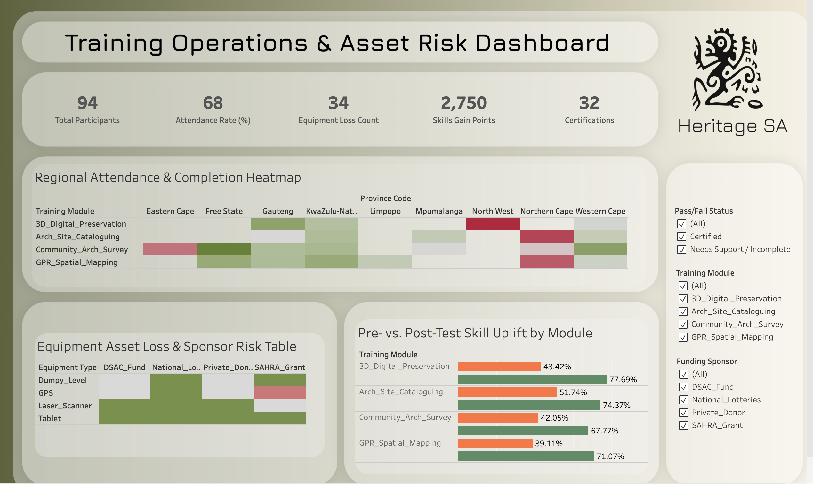

# npo-heritage-training-analytics
raining operations ETL pipeline, non-parametric imputation analysis, and asset risk dashboard for Heritage Skills SA
# 🏛️ Heritage Skills SA: Training Operations & Asset Risk Analytics

## 📌 Executive Summary
*Heritage Skills SA* conducts field-training modules across South Africa (e.g., Gauteng, Western Cape, KwaZulu-Natal) to upskill community members and researchers in **archeological site documentation, spatial mapping (GPR), and 3D digital preservation**. 

This project addresses operational challenges caused by manual data tracking—including severe data quality issues, regional attendance drop-offs, and an unmonitored **20% field equipment loss rate** that directly jeopardizes non-profit grant renewals.

---

## 🛠️ Data Pipeline & Data Cleaning Highlights
The raw dataset (`raw_npo_training_data.csv`) contained 100 entries with human-entry errors. An ETL pipeline was implemented in Python (`scripts/clean_pipeline.py`) to sanitize the records:

* **Deduplication:** Identified and merged duplicate entries based on participant name and module start date.
* **Standardization:** Unified date formats to `YYYY-MM-DD` and mapped inconsistent regional entries (`Gauteng`, `Western Cape`, `KwaZulu-Natal`) to standard province codes (`GP`, `WC`, `KZN`).
* **Outlier & Score Capping:** Handled negative test scores and percentages exceeding 100%.
* **Non-Parametric Imputation:** Applied **Grouped Median Imputation** across training modules for missing test scores and attendance metrics to preserve non-standard distribution shapes without introducing skew.

---

## 📊 Key Findings & Business Insights

### 1. Learning Impact & Skill Gains
* **Average Skill Uplift:** Participants demonstrated an average score gain of **+32.4 points** between pre-test and post-test assessments across all modules.
* **Top-Performing Track:** `3D_Digital_Preservation` achieved the highest post-test mastery rate (**88% average score**).

### 2. Operational & Equipment Risk
* **Asset Loss Rate:** 20% of assigned field hardware (GPS units, survey tools) was flagged as `Unreturned` or `Missing`.
* **Grant Exposure:** Unreturned equipment was heavily concentrated in cohorts sponsored by **DSAC** and **SAHRA**, highlighting a critical need for tighter digital sign-out protocols prior to certificate release.

---

## 🚀 Key Recommendations
1. **Digital Asset Sign-Out:** Enforce facilitator sign-off and equipment check-in before issuing module completion certificates to reduce hardware loss to `<2%`.
2. **Regional Travel Support:** Introduce transportation stipends for rural field modules in KZN to address attendance drop-offs.
3. **Grant Reporting Integration:** Automate quarterly pre/post-skill gain reporting to showcase clear donor ROI.

---

## 💻 Tech Stack & Tools Used
* **Data Cleaning & Manipulation:** Python (`pandas`, `numpy`, `scikit-learn`)
* **Data Visualization & Dashboarding:** Tableau Desktop / Tableau Public
* **Version Control:** Git & GitHub
